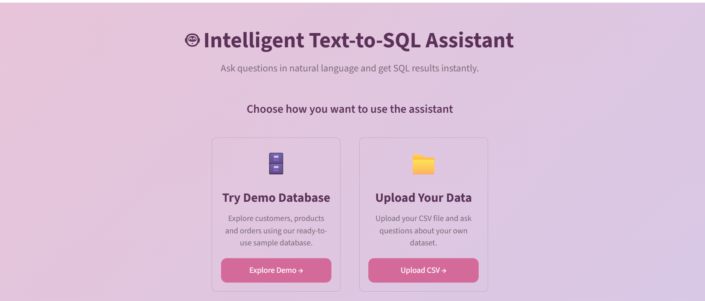

# 🤖 Intelligent Text-to-SQL Assistant

<p align="center">
  <b>Ask questions in natural language. Get SQL results instantly.</b>
</p>

<p align="center">
  An AI-powered Text-to-SQL application that converts natural language questions into SQL queries, validates them for safety, and executes them on a MySQL database.
</p>

<p align="center">
  
  
  
  
  
  
</p>

---

## 📌 Overview

**Intelligent Text-to-SQL Assistant** allows users to interact with databases using natural language instead of manually writing SQL queries.

The application uses **Google Gemini** to understand the user's question, checks whether the question is clear enough to answer, generates an appropriate SQL query, validates that query for safety, executes it on **MySQL**, and displays the results through an interactive **Streamlit** interface.

The application supports two modes:

- 🗄️ **Demo Database** — Explore a ready-to-use sample database
- 📁 **Upload Your Data** — Upload your own CSV and query it using natural language

---

## ✨ Features

| Feature | Description |
|---|---|
| 🤖 AI SQL Generation | Converts natural-language questions into SQL |
| 🗄️ Demo Database | Query sample customers, products and orders |
| 📁 CSV Upload | Upload your own dataset |
| 🔍 Schema Detection | Automatically detects uploaded table columns |
| 💬 Interactive Clarification | Detects ambiguous questions, asks a follow-up, and merges the answer back into the original question before generating SQL |
| 🔐 Hardened SQL Validation | Allows only `SELECT` / `WITH ... SELECT` queries; explicitly blocks file-read/write operations (`INTO OUTFILE`, `INTO DUMPFILE`, `LOAD_FILE`) |
| 🧯 Row Limiting | Query results are capped (`fetchmany`) so a runaway query can't pull unbounded data into memory |
| 🧵 Graceful Error Handling | LLM and database failures are caught and shown as readable messages instead of raw crashes |
| 📊 Query Results | Displays results in an interactive table |
| 🎨 Streamlit UI | Clean and interactive web interface |

---

## 🖥️ Application Preview

### 🏠 Home Screen

<p align="center">
  
</p>

The home screen provides two options:

### 🗄️ Try Demo Database

<p align="center">
  
</p>

Explore the built-in sample database without uploading any files.

### 📁 Upload Your Data

Upload a CSV file and ask questions about your own dataset.

---

## 📁 Upload Your Own Dataset

<p align="center">
  
</p>

The application:

1. Accepts a CSV file
2. Displays a data preview
3. Loads the dataset into MySQL
4. Detects the uploaded schema
5. Allows natural-language queries on the dataset

---

## 🤖 Natural Language → SQL

Example question:

```text
How many customers are from France?
```

The AI generates a SQL query such as:

```sql
SELECT COUNT(*)
FROM uploaded_data
WHERE country = 'France';
```

The generated query is validated, then executed on MySQL, and the result is displayed in the application.

---

## 💬 Intelligent Clarification

The application can detect when a question is ambiguous.

For example:

```text
User:
Show customers
```

Instead of blindly generating SQL, the application can ask:

```text
Could you clarify?

Do you want to see all customers
or customers from a specific city?
```

The user's clarification is combined with the original question (e.g. `"Show customers" + " " + "just the ones from Mumbai"`), and it is this **combined** question that is actually sent to SQL generation — so the clarification loop changes the final query, not just the message shown to the user.

---

## 🔐 SQL Safety

The application includes SQL validation to prevent accidental modification of database data.

Only read-only queries are allowed:

```text
SELECT
WITH ... SELECT
```

Queries involving operations such as:

```text
INSERT
UPDATE
DELETE
DROP
ALTER
TRUNCATE
CREATE
```

are rejected.

In addition, the following are explicitly blocked even though they technically start with `SELECT` — this is the part a simple "does it start with SELECT" check would otherwise miss:

```text
SELECT ... INTO OUTFILE '...'
SELECT ... INTO DUMPFILE '...'
SELECT LOAD_FILE('...')
```

These are blocked because they can be used to write to or read arbitrary files on the database server.

Query results are also pulled with `fetchmany(1000)` instead of `fetchall()`, so an unbounded query can't load unlimited rows into memory.

---

## 🏗️ How It Works

```text
             User Question
                   │
                   ▼
        ┌─────────────────────┐
        │ Clarification Check │
        └──────────┬──────────┘
                   │
                   ▼
     Merge clarification answer (if any)
           into the original question
                   │
                   ▼
          Google Gemini API
                   │
                   ▼
          SQL Query Generation
                   │
                   ▼
      SQL Safety Validation
   (allow-list + forbidden-operation block)
                   │
                   ▼
             MySQL Database
                   │
                   ▼
      Query Execution (row-capped)
                   │
                   ▼
             Query Results
                   │
                   ▼
           Streamlit Interface
```

---

## 🛠️ Tech Stack

### Frontend / UI

- Streamlit

### Programming Language

- Python

### Database

- MySQL
- `mysql-connector-python`

### AI / LLM

- Google Gemini API

### Data Processing

- Pandas

### Prompt Engineering

- Custom prompts for SQL generation and clarification detection

### Validation

- Pydantic

### Configuration

- python-dotenv

---

## 📂 Project Structure

```text
text-to-sql-clarification-engine/
│
├── app/
│   ├── main.py
│   ├── llm.py
│   ├── database.py
│   └── clarification.py
│
├── image/
├── .env
├── .gitignore
├── requirements.txt
└── README.md
```

---

## ⚙️ Installation

### 1. Clone the repository

```bash
git clone <YOUR-GITHUB-REPOSITORY-URL>
```

```bash
cd text-to-sql-clarification-engine
```

### 2. Create a virtual environment

```bash
python -m venv venv
```

### 3. Activate the virtual environment

#### Windows

```bash
venv\Scripts\activate
```

### 4. Install dependencies

```bash
pip install -r requirements.txt
```

---

## 🔑 Environment Variables

Create a `.env` file in the project directory:

```env
DB_HOST=localhost
DB_USER=your_username
DB_PASSWORD=your_password
DB_NAME=your_database
GEMINI_API_KEY=your_gemini_api_key
```

⚠️ **Never upload your `.env` file to GitHub.**

Add this to `.gitignore`:

```gitignore
.env
venv/
__pycache__/
*.pyc
```

---

## ▶️ Run the Application

Start the Streamlit application with:

```bash
streamlit run app/main.py
```

The application will open in your browser.

---

## 🧪 Example Dataset

You can test the application using a CSV containing columns such as:

```text
customer_id
credit_score
country
gender
age
tenure
balance
products_number
credit_card
active_member
estimated_salary
churn
```

Example questions:

```text
How many customers are from France?
```

```text
Show customers with a balance greater than 50000.
```

```text
How many customers have churned?
```

```text
Which country has the most customers?
```

```text
Show customers older than 40.
```

```text
What is the average balance?
```

---

## ⚠️ Known Limitations

- **Uploaded CSV columns are all stored as `TEXT`** in MySQL. This works for equality/filter queries, but numeric sorting (e.g. `ORDER BY balance`) sorts lexicographically rather than numerically. Type inference from the pandas dtype is a planned improvement.
- **CSV column names are not sanitized** before being used in `CREATE TABLE` / `INSERT` statements. Since the table name is currently hardcoded (`uploaded_data`), this is low risk today, but validating column names against an allow-listed pattern is planned.
- **No connection pooling** — each query opens and closes its own MySQL connection. Fine for a demo; would need pooling for real concurrent traffic.
- **SQL validation is keyword/allow-list based, not a full SQL parser.** It has been hardened against the most relevant MySQL file-read/write exploits (`INTO OUTFILE`, `INTO DUMPFILE`, `LOAD_FILE`), but a dedicated parser (e.g. `sqlparse` or `sqlglot`) would give stronger guarantees than string matching.

---

## 🚀 Future Improvements

- 📈 Automatic data visualizations
- 🕘 Query history
- 🧠 Type-aware schema handling for uploaded CSVs
- 🗃️ Support for additional databases
- ⚡ Better SQL error handling
- 📊 Automatic chart generation
- 🔎 Parser-based SQL validation instead of keyword matching
- 🔐 Connection pooling for concurrent usage

---

## 🎯 Project Highlights

This project demonstrates practical implementation of:

- Natural Language Processing
- Generative AI
- LLM-based SQL generation
- Prompt engineering
- Structured LLM outputs with Pydantic (`response_schema`)
- Multi-turn clarification: detecting ambiguity, asking a follow-up, and merging the answer back into the original request
- Defense-in-depth SQL validation (allow-listing query types *and* blocking known exploit patterns)
- Graceful error handling around external API calls and database operations
- Database connectivity
- Schema handling
- CSV-to-MySQL data loading
- Streamlit application development

---

## 👩‍💻 Author

### Somya Nema

**B.Tech — Artificial Intelligence & Machine Learning**

---

## ⭐ If You Like This Project

If you find this project useful, consider giving the repository a ⭐ on GitHub!

```text
Made with Python + Streamlit + MySQL + Gemini 🤖
```
